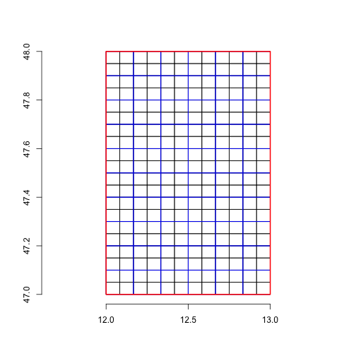
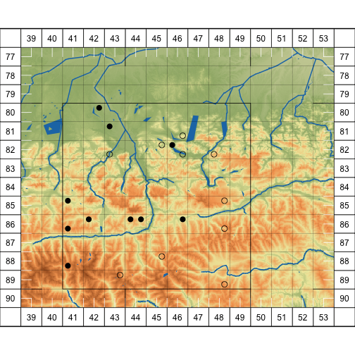

Using the sabotag package to plot distribution maps
===================================================

Getting started
---------------

To work with the sabotag package, if necessary:

* Install [R](http://www.r-project.org/)
* Install the lastest version of package [sabotag](https://github.com/kardinal-eros/sabotag-tools) and [sabotag-data]
(https://github.com/kardinal-eros/sabotag-data) and its dependencies from [CRAN](https://cran.r-project.org).

<!-- To run the basic working example that produced this post: -->

<!-- 
setwd("/Users/roli/Desktop/gist")
library(knitr)
knit("example.rmd")
--> 

Starting a session then is easy.


```r
library(sabotag)
```

```
## Loading required package: raster
```

```
## Loading required package: sp
```

```
## Loading required package: rgeos
```

```
## rgeos version: 0.3-26, (SVN revision 560)
##  GEOS runtime version: 3.4.2-CAPI-1.8.2 r3921 
##  Linking to sp version: 1.2-5 
##  Polygon checking: TRUE
```

```
## Loading required package: curl
```

```
## Loading required package: sabotagdata
```

```
## 
## Attaching package: 'sabotagdata'
```

```
## The following object is masked from 'package:datasets':
## 
##     rivers
```

```
## 
## Attaching package: 'sabotag'
```

```
## The following object is masked from 'package:graphics':
## 
##     grid
```

```
## The following object is masked from 'package:grDevices':
## 
##     pdf
```


## Fundamentals about the mapping scheme for the recording of the (vascular plant) flora of Central Europe (“Kartierung der Flora Mitteleuropas”)


***How the grid is defined***


The basic unit is the so called *Grundfeld* or grid unit. In the package's naming conventions this is called: `GRID`. It measures 10 × 6 degrees in geographic coordinates. This grid is further subdivided into four *Quadranten* or grid cells (`GRIDCELL`) in the shape of 5 × 3 degrees. According to this, there is a certain hierarchy of two resolutions, that can be developed further into sixteenth part. The  *Quadranten* resolution has become traditional for botanists and policy makers and is well known. See Niklfeld (1971) for an early reference. He uses grid unit for a continental wide map, although the dat collected were recored a finer levels.

You might for sure know the name of your home `Quadrant`, do you? Mine is `8244-1`!


***Query the grid***


Invoke the console …


```r
lnglat2gridcell(13, 47)
```

```
## GRIDCELL     GRID     CELL 
## "9044-4"   "9044"      "4"
```

… to find out yours! Simply input your numbers and type: `lnglat2gridcell(YourLongitude, YourLatitude)`.

The grid cells (‘Quadranten’) are almost always the resolution reported for floristic records along with geographic coordinates. If no more detailed data is available, quite often the center coordinate of grid cell is reported. As we saw, any coordinate can be queried for a grid cell, as can be the reverse …


```r
gridcell2lnglat("8244-1")
```

```
##          [,1]   [,2]
## [1,] 13.04167 47.775
```
… `gridcell2lnglat()` returns the grid cell mid point, it's center. 

***Grid cell identifier***

The before mentioned hierarchy is also displayed as a unique grid cell identifier. Grid cells are addressed with a separator character, the default is to use a dash (`-`) or minus sign. Many versions thereof exist. Omitting the separator is common in data sets.

Displays the whole thing.


```r
deparseGridcell("8244-1")
```

```
##      GRIDCELL GRID   CELL ROW  COLUMN
## [1,] "8244-1" "8244" "1"  "82" "44"
```


## Create mapping grid based on a cartographic section

***Coordinate System***

Coordinates are always geographic coordinates (`CRS("+init=epsg:4326")`).

***Define extent***

Let's start with some dummy data. First, we define an arbitrary cartographic extent that fits our region of interest (e.g. a study area). All fundamental functions in the *sabotag package* build upon `Extent` objects defined in the [raster](https://CRAN.R-project.org/package=raster) package. As a first step, we will create an `Extent` object with coordinate bounds between 12° and 13° longitude and 47° and 48° latitude, respectively. This is as simple as:


```r
e <- extent(c(xmin = 12, xmax = 13, ymin = 47, ymax = 48))
```

This line of code can also be written as (type `?extent` for details):


```r
e <- extent(12, 13, 47, 48)
```

It also possible to return an extent for any `Spatial*` object to define your region.


```r
extent(YourSpatialObject)
```

Now let's inspect what the `extent`function returned.


```r
print(e)
```

```
## class       : Extent 
## xmin        : 12 
## xmax        : 13 
## ymin        : 47 
## ymax        : 48
```

Well, that looks as expected.

***Work with extent***

With this `Extent` object at hand we want to find a mapping grid that perfectly fits within the bounding box. The `floragrid` function does this job. Check the help page (`?floragrid`) for details. Objects are of class `SpatialPolygonsDataFrame` and methods for this class apply, e.g. save to ESRI shapefile via `writeOGR`.


```r
g <- floragrid(e)

head(g@data)
```

```
##   GRIDCELL GRID CELL
## 1   8038-1 8038    1
## 2   8038-2 8038    2
## 3   8039-1 8039    1
## 4   8039-2 8039    2
## 5   8040-1 8040    1
## 6   8040-2 8040    2
```

It is easy to plot what we did so far. First we plot the grid along with axes. Then, a polygon representing the initial extent is overlayed. The `pretty` functions finds intervals that perfectly fit the mapping grid scheme. It accept two resolutions: grid units (resolution `GRID`) or grid cells (resolution `CELL`). We check what the function suggests and test it graphically against a grid in resolution `GRID`. `extent2polygon` is a method defined for `Spatial*` objects. It is helpful in plotting `Extent` objects.


```r
plot(g)
axis(1) # longtiude
axis(2) # latitude

plot(extent2polygon(e), add = TRUE, border = 2)

plot(floragrid(e, resolution = "GRID"), add = TRUE, border = 4)
```


Note the `floragrid` function reports: `can't calculate proper GRIDCELL … `, because there are four possibilities. We learn also that a grid of grid cells does not necessarily fit in a grid at coarser resolution. Complicated! No question, there is s solution!

## All in one background solution

This task is quite eas, thanks to some data sets in the *sabotagdata* package. Namely hydrography and topography data sets as well as high accuracy administrative borders for Austria. Using the extent as above, defining a background objects takes only one step.


```r
data(BEV)

e <- extent(12, 13, 47, 48)
b <- background(e)

class(b)
```

```
## [1] "Background"
## attr(,"package")
## [1] "sabotag"
```

```r
names(layers(b))
```

```
## [1] "extent"    "rivers"    "lakes"     "relief"    "grid"      "gridlines"
```

```r
#	call the plot function
plot(b)
```


## More advanced uses

***Configure an extent as plot region***

```r
#	set extent! somewhere in Salzburg
e0 <- extent(12.5,14,47,48)
e <- pretty(e0, resolution = "GRID")

#	version with buffer
pe <- pretty(e, resolution = "GRID", add = 1, mar = c(1,2,3,4))

#	set background for this version of extent
b <- background(pe, reliefmap = TRUE, tol = 1)
```

***Create some dummy occurrences***


```r
g <- floragrid(e)

#	two species dummy data in extent
#	by sampling gird cells

i1 <- sample(g$GRIDCELL, 10)
x1 <- data.frame(taxon = "Genus species",
	gridcell = i1)
i2 <- sample(g$GRIDCELL, 10)
x2 <- data.frame(taxon = "Genus species spp. subspecies",
	gridcell = i2)
x <- rbind(x1, x2)
#	make object Spatial*
coordinates(x) <- gridcell2lnglat(x$gridcell)

o <- occurrences(x)
```

***Plot the map***


```r
#	plot background
plot(b)

#	add occurrence points
points(o[o$taxon == "Genus species", ], pch = 16, cex = 1.5)
points(o[o$taxon == "Genus species spp. subspecies", ], pch = 1, cex = 1.5)

#	frame depicting extent objects
plot(extent2polygon(e), add = TRUE)
plot(extent2polygon(b), add = TRUE, lwd = 3)

#	plot ticks
ticks(pretty(extent(b), add = -1), "CELL", col = "white")
ticks(pretty(extent(b), add = -1), coarse = TRUE)
```

```
## coarse TRUE
```

```r
#	style plot margin
plot(margin(b), add = T, col = "white")

#	label margins
labelmargin(b)
```



## Output to pdf to create an atlas

The `pdf` function provides means to plot a single background to be overlayed with individual point maps. In a many page bundle this reduces file size if backgrounds are embedded using a reference, as in Adobe software or LaTex.


Geocoding floristic data sets with the sabotag package
======================================================


```r
x <- data.frame(accuracy = 10, x = 10:16, y = 47)
coordinates(x) <- ~x+y
proj4string(x) <- CRS("+init=epsg:4326")
```


```r
geocode.austria(x)
```

```
##                              coordinates
## 1 520 masl, 47.000000N, 10.000000E, ±10m
## 2 400 masl, 47.000000N, 11.000000E, ±10m
## 3 370 masl, 47.000000N, 12.000000E, ±10m
## 4 300 masl, 47.000000N, 13.000000E, ±10m
## 5 290 masl, 47.000000N, 14.000000E, ±10m
## 6 360 masl, 47.000000N, 15.000000E, ±10m
## 7 270 masl, 47.000000N, 16.000000E, ±10m
##                                                         locality
## 1        Österreich, Vorarlberg, Bezirk Bludenz, St. Gallenkirch
## 2                         Österreich, Tirol, Bezirk Imst, Sölden
## 3  Italia, TAA, Pustertal - Val Pusteria, Ahrntal - Valle Aurina
## 4 Österreich, Kärnten, Bezirk Spittal an der Drau, Großkirchheim
## 5           Österreich, Steiermark, Bezirk Murau, Stadl-Predlitz
## 6       Österreich, Steiermark, Bezirk Voitsberg, Hirschegg-Pack
## 7       Österreich, Steiermark, Bezirk Südoststeiermark, Fehring
```


```r
safapi(13, 47, c("geb", "q"), "csv")
```

```
##    x  y               name quadrant
## 1 13 47 Sonnblick - Böseck   9043-2
```


```r
elevation(lng = 13, lat = 47, sp = FALSE)
```

```
##   latitude elevation longitude
## 1       13       299        13
```


```r
bergfex(lng = 13, lat = 47, sp = FALSE)
```

```
## $data
##        ID                          Name      Staat
## 1 1359799                  Sandfeldkopf           
## 2 1376987                       Saukopf           
## 3 1374765                Schwarzseekopf           
## 4 1376962             Bogenitzenscharte           
## 5 1880001 Sandfeldkopf von Innerfragant Österreich
## 6 1396583                     Weißensee           
##                        Region Hoehe GeoBreite GeoLaenge ID_GeoPunkteTypen
## 1 Kärnten/Spittal an der Drau 2920m 46.998797 13.004404              7304
## 2 Kärnten/Spittal an der Drau 2786m 46.996248 13.008342              7305
## 3 Kärnten/Spittal an der Drau 2825m 47.007982 13.004767              7305
## 4 Kärnten/Spittal an der Drau 2665m 46.992739 12.996400              7305
## 5                     Kärnten       46.998726 13.004258                29
## 6 Kärnten/Spittal an der Drau 2543m 47.007632 12.998010              7514
##                                   Typ Level
## 1      Berg, Tal (geringer bedeutend)    10
## 2         Berg, Tal (lokal bedeutend)    11
## 3         Berg, Tal (lokal bedeutend)    11
## 4         Berg, Tal (lokal bedeutend)    11
## 5                                Tour    28
## 6 See, Teich (< 2km Längenausdehnung)    42
##                                                                   Link
## 1                                                                     
## 2                                                                     
## 3                                                                     
## 4                                                                     
## 5 /sommer/kaernten/touren/skitour/50002,sandfeldkopf-von-innerfragant/
## 6                                                                     
## 
## $coordinate
## $coordinate$lat
## [1] 47
## 
## $coordinate$lng
## [1] 13
```

### Access Zobodat specimens


```r
r <- zobodat("Poa", "pratensis")
```

```
## waiting for server, be patient
```

```r
require(maps)
```

```
## Loading required package: maps
```

```r
map(region ="Austria")
points(r)
```


```r
r$taxon <- paste(r$Gattung, r$Art)
o <- occurrences(r)

g <- background(r, reliefmap = FALSE)
plot(g)
points(o)
```


## References

Niklfeld, H. (1978): Grundfeldschlüssel für die Kartierung der Flora Mitteleuropas, südlicher Teil (= Zentralstelle für Florenkartierung, Inst. Bot. Univ. Wien). Wien.
