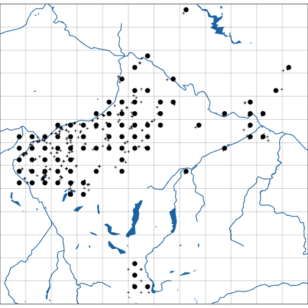

<!--

---
title: The sabotag package
author: Roland Kaiser
date: 2018-01-23
---

--->


Using the sabotag package to plot distribution maps
===================================================


Getting started
---------------


To work with the sabotag package, if necessary:

* Install [R](http://www.r-project.org/)
* Install the latest version of package [sabotag](https://github.com/kardinal-eros/sabotag-tools) and [sabotag-data](https://github.com/kardinal-eros/sabotag-data) and its dependencies from [CRAN](https://cran.r-project.org). The example uses the [maps](https://cran.r-project.org/web/packages/maps/index.html). Ensure this package is installed also.

<!-- To run the basic working example that produced this post: -->

<!-- 
setwd("/Users/roli/Documents/sabotagmaps")
library(knitr)
knit("example.rmd")
--> 

Starting the package in an *R* session is easy.


```r
library(sabotag)
```


The mapping scheme
------------------

***Mapping grid definition***

The mapping scheme for the recording of the (vascular plant) flora of Central Europe (“Kartierung der Flora Mitteleuropas”) conists of a recangular grid defined in the space of geographic corrdinates and supplemented with a unique id field (Niklfeld 1971).

The basic unit is the so called *Grundfeld* or grid unit. In the package's naming conventions this is called: `GRID`. It measures 10 × 6 degrees in geographic coordinates. The grid unit is further subdivided into four *Quadranten* or grid cells (`GRIDCELL`) in the shape of 5 × 3 degrees. According to this, there is a hierarchy of two resolutions. Grid units can be developed further into sixteenth part. The  *Quadranten* resolution has become traditional for botanists and policy makers and is well known. See Niklfeld (1971) for an early reference. He uses the grid unit for a continental wide map, although the data collected were recorded a finer levels.

You might for sure know the name of your home grid cell (*Quadrant*), do you? Mine is `8244-1`!


***Query the grid***


Invoke the console …


```r
lnglat2gridcell(13, 47)
```

```
## GRIDCELL     GRID     CELL 
## "9044-4"   "9044"      "4"
```

… to find out yours! Simply input your numbers and type: `lnglat2gridcell(YourLongitude, YourLatitude)`.

The grid cells (*Quadranten*) are almost always the resolution reported for floristic records along with geographic coordinates and locality description. In cases when detailed locality data (coordinates) are missing, quite often the center coordinate of grid cells is reported as geographic coordinates without an identification of accuracy. This can be misleading. Nonetheless, any coordinate can be queried for a grid cell, as can be the reverse.


```r
gridcell2lnglat("8244-1")
```

```
##          [,1]   [,2]
## [1,] 13.04167 47.775
```

Note, `gridcell2lnglat()` returns the grid cell's mid point, it's center coordinate. 

***Grid cell identifier***

The before mentioned hierarchy is also displayed as a unique grid cell identifier (*Grundfeldschlüssel*). Grid cells are addressed with a separator character, the default is to use a dash (`-`) or minus sign. Many versions thereof exist. Omitting the separator is common in data sets (see `?deparseGridcell`).


```r
deparseGridcell("8244-1")
```

```
##      GRIDCELL GRID   CELL ROW  COLUMN
## [1,] "8244-1" "8244" "1"  "82" "44"
```

The function `deparseGridcell` returns all components that can be extracted from the grid cell identifier.
 

Create mapping grid based on a cartographic section
---------------------------------------------------


***Coordinate System***

Coordinates are always geographic coordinates (`CRS("+init=epsg:4326")`).

***Define extent***

Let's start with some dummy extent. First, we define an arbitrary cartographic extent that fits our region of interest (e.g. a study area). All fundamental functions in the *sabotag package* build upon `"Extent"` objects defined in the [raster](https://CRAN.R-project.org/package=raster) package. As a first step, we will create an `"Extent"` object with coordinate bounds between 12° and 13° longitude and 47° and 48° latitude, respectively. This is as simple as:


```r
e <- extent(c(xmin = 12, xmax = 13, ymin = 47, ymax = 48))
```

This above line of code can also be written as (type `?extent` for details):


```r
e <- extent(12, 13, 47, 48)
```

It also possible to return an extent for any `Spatial*` object to define your region.


```r
extent(YourSpatialObject)
```

Now let's inspect what the `extent`function returned.


```r
print(e)
```

```
## class       : Extent 
## xmin        : 12 
## xmax        : 13 
## ymin        : 47 
## ymax        : 48
```

Well, that looks as expected.

***Work with extent***

With this `"Extent"` object at hand we want to find a mapping grid that perfectly fits within the bounding box. The `floragrid` function does this job. Check the help page (`?floragrid`) for details. The returned objects are of class `"SpatialPolygonsDataFrame"` and all methods for this class apply (see package [sp](https://cran.r-project.org/web/packages/sp/index.html)). Writing files to disk, e.g. ESRI shape file, can be done via the `writeOGR` function in package [rgdal](https://cran.r-project.org/web/packages/rgdal/index.html). Both packages get attached during loading of the *sabotag* package.

Let's see what the `floragrid` function returns when called with the `"Extent"` object above.


```r
# compute grid
g <- floragrid(e)
```

The `floragrid` function reports all relevant details about a grid cell.


```r
# display attribute data, the first six rows by default
head(g)
```

```
##   GRIDCELL GRID CELL
## 1   8038-1 8038    1
## 2   8038-2 8038    2
## 3   8039-1 8039    1
## 4   8039-2 8039    2
## 5   8040-1 8040    1
## 6   8040-2 8040    2
```

It is easy to plot what we created so far. First we plot the grid along with axes. Then, a polygon representing the initial extent is overlayed. The `pretty` functions finds intervals that perfectly fit the mapping grid scheme. It accept two resolutions: grid units (resolution `GRID`) or grid cells (resolution `CELL`). The `pretty` function is essential in a standard workflow. Beware, the `floragrid` function also accepts argument `resultion` to be passed internally to function `pretty`.


```r
# plot the grid
plot(g, border = "black")

# plot axes
axis(1) # longtiude
axis(2) # latitude

# mapping grid based on extent with 'pretty' limits
g <- floragrid(e, resolution = "GRID")
plot(g, add = TRUE, border = "blue")

# polygon of initial extent
ep <- extent2polygon(e)
plot(ep, add = TRUE, lwd = 2, border = "red")
```


Note, `extent2polygon` is a method defined for `"Spatial*"` objects. Polygon versions are helpful in plotting `"Extent"` objects. All classes defined in the *sabotag* package return it's `"Extent"` when called with the `extent` function. Styling of graphics is controlled by arguments `lwd` (line width) and `border` (color of the polygon edges).

Depending on the coordinate bounds of the initial `"Extent"` object, we expect that a grid of grid cells does not necessarily fit into a grid at the coarser `GRID` resolution. Complicated! No question, there is a solution!


A solution for the creation of map backgrounds
----------------------------------------------


This task can be achieved without great effort, thanks to some data sets in the *sabotagdata* package. Namely hydrography, topography data sets, as well as high accuracy administrative borders for Austria. Using the extent as above, defining a background objects takes only a single additional line of code.


```r
# define extent
e <- extent(12, 13, 47, 48)
# create background
b <- background(e)

# show class and layers
class(b)
```

```
## [1] "Background"
## attr(,"package")
## [1] "sabotag"
```

```r
names(layers(b))
```

```
## [1] "extent"    "rivers"    "lakes"     "relief"    "grid"      "gridlines"
```

```r
#	call the plot method
plot(b)
```


More advanced uses
------------------


***Configure an extent as plot region***

```r
#	set extent! somewhere in Salzburg
e0 <- extent(12.5,14,47,48)
e <- pretty(e0, resolution = "GRID")

#	version with buffer
# argument `add` adds a defined number of bordering rectangles of grid units 
# argument `mar` set the outer margins a vector of the form c(bottom, left, top, right)
pe <- pretty(e, resolution = "GRID", add = 1, mar = c(1,2,3,4))

#	set background for this version of extent
b <- background(pe, reliefmap = TRUE, tol = 1)
```

***Create some dummy occurrences***


```r
g <- floragrid(e)

#	two species dummy data in extent
#	by sampling gird cells

# to random sample reproducible
set.seed(1234)

i1 <- sample(g$GRIDCELL, 10)
x1 <- data.frame(taxon = "Genus species",
	gridcell = i1)
i2 <- sample(g$GRIDCELL, 10)
x2 <- data.frame(taxon = "Genus species spp. subspecies",
	gridcell = i2)
x <- rbind(x1, x2)
#	make object 'Spatial*'
coordinates(x) <- gridcell2lnglat(x$gridcell)

o <- occurrences(x)
```

***Plot the map***


```r
#	plot background
plot(b)

#	add occurrence points
points(o[o$taxon == "Genus species", ], pch = 16, cex = 1.5)
points(o[o$taxon == "Genus species spp. subspecies", ], pch = 1, cex = 1.5)

#	frame depicting extent objects
plot(extent2polygon(e), add = TRUE)
plot(extent2polygon(b), add = TRUE, lwd = 3)

#	plot ticks
ticks(pretty(extent(b), add = -1), "CELL", col = "white")
ticks(pretty(extent(b), add = -1), coarse = TRUE)

#	style plot margin
plot(margin(b), add = T, col = "white")

#	label margins
labelmargin(b)
```


Output to pdf to create an atlas
--------------------------------

The `pdf` functions for classes `"Background"`and `"Occurrences"` provides means to plot a single background to be overlayed with individual point maps. In a many page bundle this can help to reduce file size. Especially if background graphics are embedded using a reference to a single PDF element, as can be done in Latex or Adobe software.


Geo-coding floristic data sets with the sabotag package
======================================================

***Option 1, datsets in sabotag-data***

Simulate dummy data.


```r
x <- data.frame(accuracy = 10, x = 10:16, y = 47)
coordinates(x) <- ~x+y
proj4string(x) <- CRS("+init=epsg:4326")
```

Perform query.


```r
geocode.austria(x)
```

```
##                              coordinates
## 1 520 masl, 47.000000N, 10.000000E, ±10m
## 2 400 masl, 47.000000N, 11.000000E, ±10m
## 3 370 masl, 47.000000N, 12.000000E, ±10m
## 4 300 masl, 47.000000N, 13.000000E, ±10m
## 5 290 masl, 47.000000N, 14.000000E, ±10m
## 6 360 masl, 47.000000N, 15.000000E, ±10m
## 7 270 masl, 47.000000N, 16.000000E, ±10m
##                                                         locality
## 1        Österreich, Vorarlberg, Bezirk Bludenz, St. Gallenkirch
## 2                         Österreich, Tirol, Bezirk Imst, Sölden
## 3  Italia, TAA, Pustertal - Val Pusteria, Ahrntal - Valle Aurina
## 4 Österreich, Kärnten, Bezirk Spittal an der Drau, Großkirchheim
## 5           Österreich, Steiermark, Bezirk Murau, Stadl-Predlitz
## 6       Österreich, Steiermark, Bezirk Voitsberg, Hirschegg-Pack
## 7       Österreich, Steiermark, Bezirk Südoststeiermark, Fehring
```

***Option 2, Standortsanalyse API***


```r
safapi(13, 47, c("gebirge", "msm"), format = "csv")
```

```
##    x  y               name      msm
## 1 13 47 Sonnblick - Böseck 2720.786
```

***Option 2, Bergfex API***


```r
bergfex(lng = 13, lat = 47)
```

```
## $data
##        ID                          Name      Staat
## 1 1359799                  Sandfeldkopf           
## 2 1376987                       Saukopf           
## 3 1374765                Schwarzseekopf           
## 4 1376962             Bogenitzenscharte           
## 5 1880001 Sandfeldkopf von Innerfragant Österreich
## 6 1396583                     Weißensee           
##                        Region Hoehe GeoBreite GeoLaenge ID_GeoPunkteTypen
## 1 Kärnten/Spittal an der Drau 2920m 46.998797 13.004404              7304
## 2 Kärnten/Spittal an der Drau 2786m 46.996248 13.008342              7305
## 3 Kärnten/Spittal an der Drau 2825m 47.007982 13.004767              7305
## 4 Kärnten/Spittal an der Drau 2665m 46.992739 12.996400              7305
## 5                     Kärnten       46.998726 13.004258                29
## 6 Kärnten/Spittal an der Drau 2543m 47.007632 12.998010              7514
##                                   Typ Level
## 1      Berg, Tal (geringer bedeutend)    10
## 2         Berg, Tal (lokal bedeutend)    11
## 3         Berg, Tal (lokal bedeutend)    11
## 4         Berg, Tal (lokal bedeutend)    11
## 5                                Tour    28
## 6 See, Teich (< 2km Längenausdehnung)    42
##                                                                   Link
## 1                                                                     
## 2                                                                     
## 3                                                                     
## 4                                                                     
## 5 /sommer/kaernten/touren/skitour/50002,sandfeldkopf-von-innerfragant/
## 6                                                                     
## 
## $coordinate
## $coordinate$lat
## [1] 47
## 
## $coordinate$lng
## [1] 13
```

***Option 2, Openstreetmap API***


```r
nominatim(lng = 13, lat = 47)
```

```
##           ST      BL                  PB       PG
## 1 Österreich Kärnten Spittal an der Drau Flattach
```

***Openelevation API***


```r
elevation(lng = 13, lat = 47)
```

```
##   latitude elevation longitude
## 1       13       299        13
```


Access Zobodat specimens
========================

It is straight forward to query the *ZOBODAT* data base and plot maps.


```r
# perform query
r <- zobodat("Poa", "pratensis")

# plot
require(maps)
# low resoltion map of Austria
map(region ="Austria")
# occurence points
points(r)
```


```r
# concatenate taxon string
r$taxon <- paste(r$Gattung, r$Art)

# promote to object of class `Occurrences`
o <- occurrences(r)

# configure a background based on the extent of class `Occurrences`
e <- pretty(extent(o), resolution = "GRID")
# skip the creation of a relief map
g <- background(e, reliefmap = FALSE)

# plot background
plot(g)
# plot coordinates
plot(o, type = "ASIS", pch = 3, cex = 0.5)
# plot occupied grid cells only
plot(o, type = "GRIDCELL", pch = 16, cex = 1.5)
```




References
==========

Niklfeld, H. (1971): Bericht über die Kartierung der Flora Mitteleuropas. Taxon 20: 545-571

Niklfeld, H. (1978): Grundfeldschlüssel für die Kartierung der Flora Mitteleuropas, südlicher Teil (= Zentralstelle für Florenkartierung, Inst. Bot. Univ. Wien). Wien.
